# Fall of Roman Britain
## by Tadhg Nolan

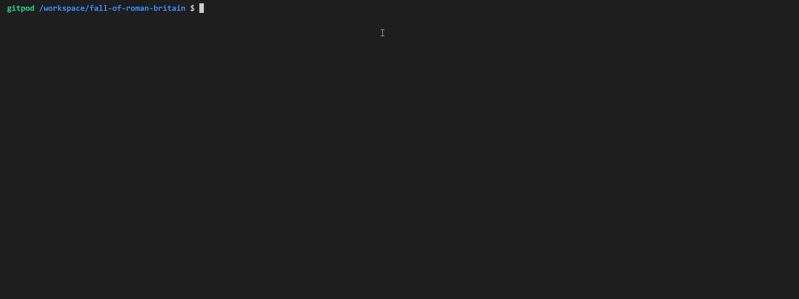

[Live Site](https://fall-of-roman-britain.herokuapp.com/)

# Table of Contents
1. [Intro](#intro)
2. [Technologies](#technologies)
3. [Testing](#testing)
4. [Credits](#credits)
5. [Deployment](#deployment)
6. [Credits](#credits)

## Intro

 - Fall of Roman Britain is a multiple choice text based game that pays tribute to classic text adventure games such as "Zork" and choose your own adventure books.  

### Design

[Code Logic Flow Chart](documentation/flowchart_main.png)

### Users

- The user will either be of the age group familiar with these books and may find some nostalgia in the reference present or completely new to the convention and find some novelty within it. They should expect to find a story with multiple choices for both direction and action, as per the orignal inspiration. Certain choices will have consequences at the end of the game.

## Technologies

### Languages

- [Python](https://www.python.org/about/)

### Other Technologies and Libraries 

- [GitHub](https://github.com/)
- [Termcolor](https://pypi.org/project/termcolor/)
- [GitPod](https://www.gitpod.io/about/)
- [Heroku](https://heroku.com)

## Features 

### Existing Features

- Start_Game - Function presents takes input of PLAYER_NAME, sets it as a global variable so it can be recalled throughout the game, then utilizes it with a player greeting.

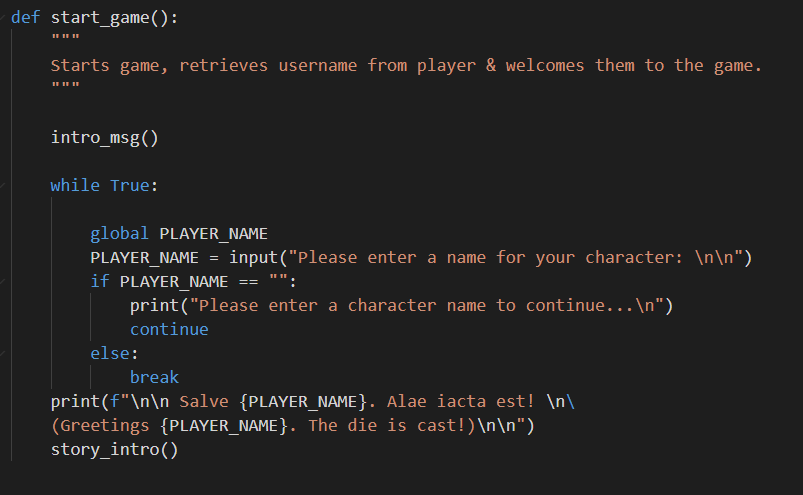

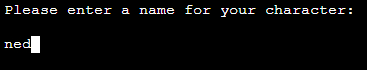

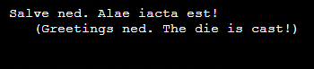

- intro_msg function - Prints intro text with ASCII artwork.

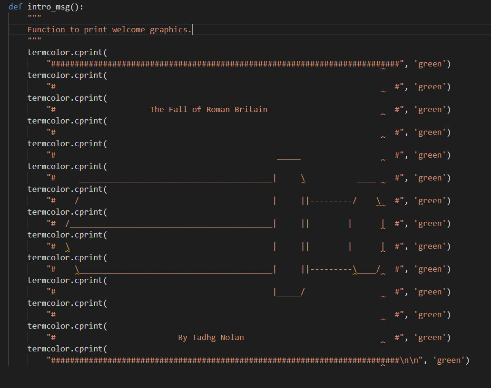

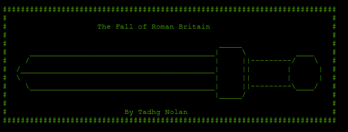

- cont function - allows continuity from one text block to the next.

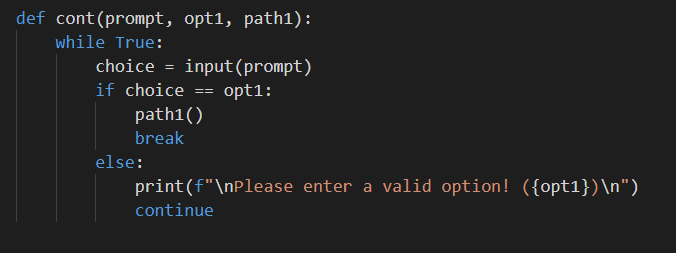

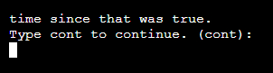

- two_choice_option function - Loop, which, when given correct input, allows one of two given paths to be executed.

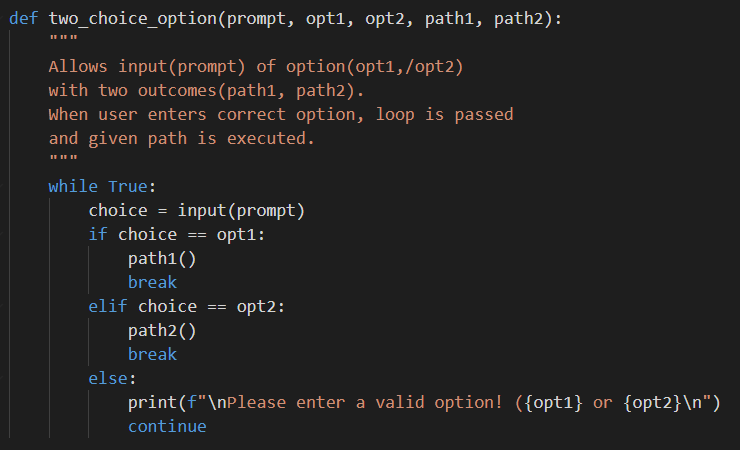

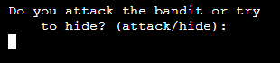

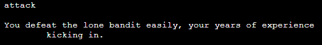

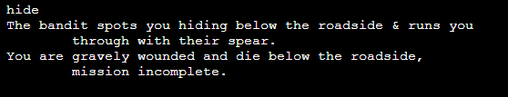

- three_choice_option function - Loop, which, when given correct input, allows one of three given paths to be executed. 

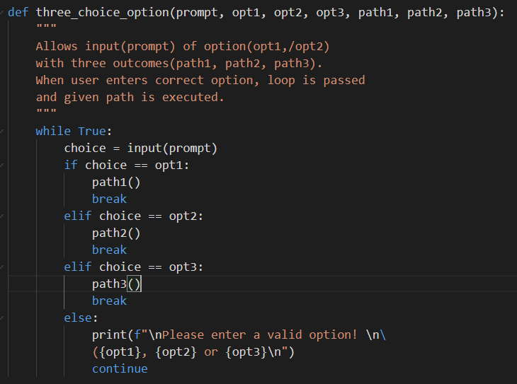

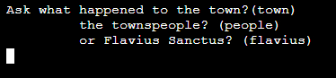

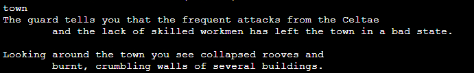

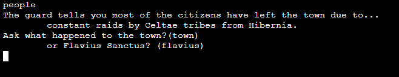

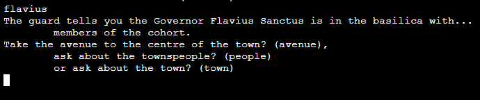

- game_over function - Presents player with an end screen when they make a choice leading to character death.

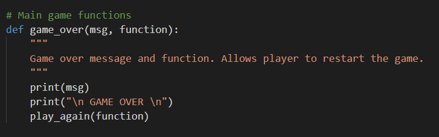

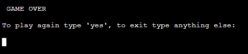

- game_win function - Presents player with a win screen when they complete the adventure sucessfully.

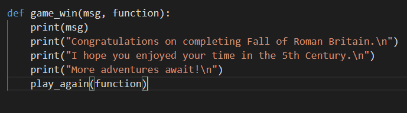

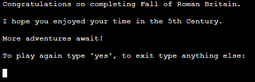

- play again function - Works with both game_over and game_win functions to allow the player to either start again or exit the game.

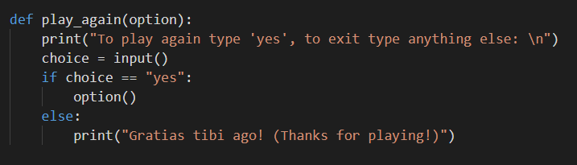

### Features Left to Implement

- Inventory.
- Additional story branches and decisions.

## Testing

### Manual testing

- Manually testing each each path.  										

### Validator Testing 

Used [PEP8 online](http://pep8online.com/) code checker to correct any errors in my code. 

### Unfixed Bugs

Line too long for ASCII art. I was unable to resolve this issue.
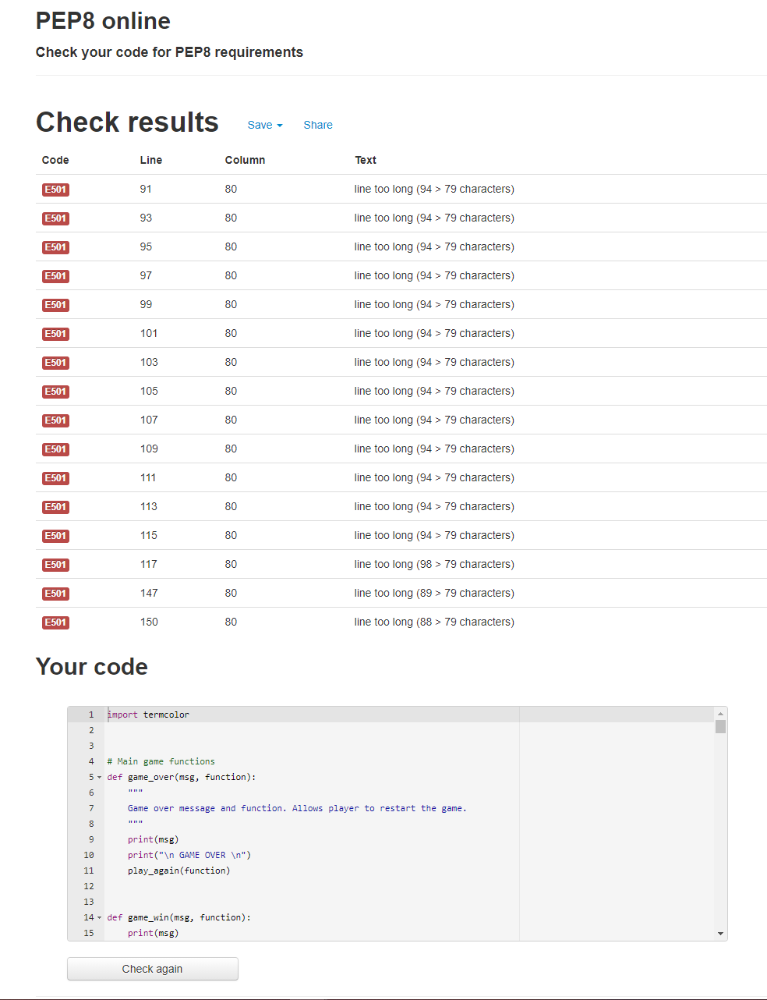

## Deployment 

- The site was deployed via Heroku. The steps to deploy are as follows: 
  
  -  Enter following command in terminal: 'Pip3 freeze > requirements.txt'.
  - From Heroku Dashboard: Create new app. Select region. Go to settings tab => add buildpacks for Python and NodeJS. Make sure Python is on top and NodeJS beneath.
  - Go to deploy section and select Github.
  - Search for repository name => click connect => click automatic or manual deploy.
  
- To clone to a local machine follow these steps:
  
  - On GitHub, navigate to the main page of the repository.
  - Above the list of files, click download Code.
  - To clone the repository using HTTPS, under "Clone with HTTPS", click the clipboard icon.
  - Open Git Bash.
  - Change the current working directory to the location where you want the cloned directory.
  - Type git clone, and then paste the URL you copied earlier.
    `$ git clone https://github.com/YOUR-USERNAME/YOUR-REPOSITORY`
  - Press Enter to create your local clone. 
  	`$ git clone https://github.com/YOUR-USERNAME/YOUR-REPOSITORY`
    ``> Cloning into `Spoon-Knife`...``
    `> remote: Counting objects: 10, done.`
    `> remote: Compressing objects: 100% (8/8), done.`
    `> remove: Total 10 (delta 1), reused 10 (delta 1)`
    `> Unpacking objects: 100% (10/10), done.`
   
   

## Credits 

 - A text adventure game written and coded by Tadhg Nolan.
 
### Content 

- [Escape the Cave](https://github.com/roomacarthur/escape-the-cave/blob/main/run.py) - Used  and modified code from this Github repository.

### Special Thanks

- Cormac Nolan - Feedback and advice.
- Tim Nelson - Mentor.