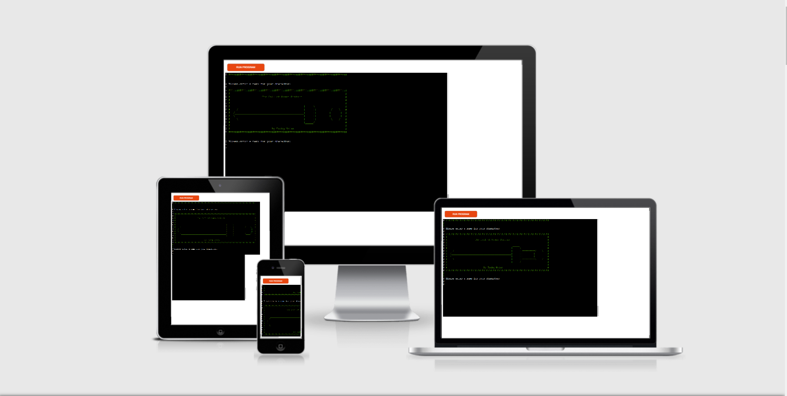
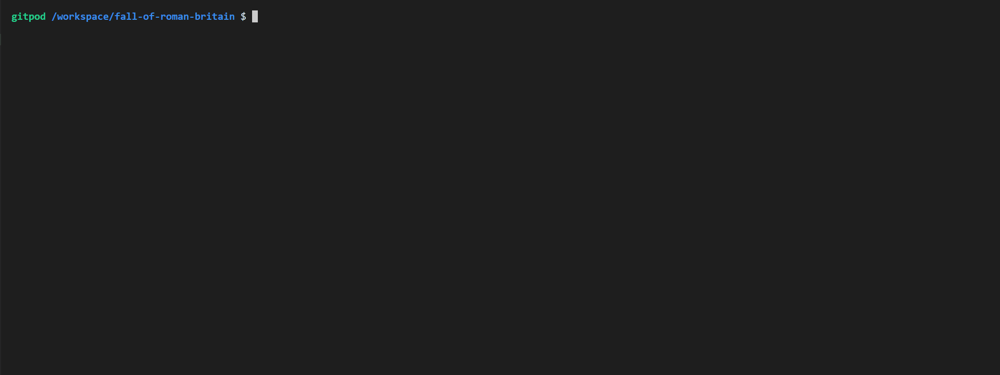

# Fall of Roman Britain
## by Tadhg Nolan

## Intro

 - Fall of Roman Britain is a multiple choice text based game that pays tribute to classic text adventure games such as "Zork" and choose your own adventure books.  

## Design

[Code Logic Flow Chart](documentation/flowchart_main.png)

## Users

- The user will either be of the age group familiar with these books and may find some nostalgia in the reference present or completely new to the convention and find some novelty within it. They should expect to find a story with multiple choices for both direction and action, as per the orignal inspiration. Certain choices will have consequences at the end of the game.

## Features 

### Existing Features

- Player Name. Function which takes input of player name and sets it as a global variable so it can be recalled later.

- cont function to allow continuity from one text block to the next.

- two_choice_option function. Loop, which, when given correct input, allows one of two given paths to be executed.

- three_choice_option function. Loop, which, when given correct input, allows one of three given paths to be executed. 

### Features Left to Implement

- Inventory.
- Additional story branches and decisions.

## Testing 

### Manual testing

- Manually testing each option.  										

### Validator Testing 

### Unfixed Bugs

## Deployment

This section should describe the process you went through to deploy the project to a hosting platform (e.g. GitHub) 

- The site was deployed via Heroku. The steps to deploy are as follows: 
   
  
- To clone to a local machine follow these steps:
  
  - On GitHub, navigate to the main page of the repository.
  - Above the list of files, click download Code.
  - To clone the repository using HTTPS, under "Clone with HTTPS", click the clipboard icon.
  - Open Git Bash.
  - Change the current working directory to the location where you want the cloned directory.
  - Type git clone, and then paste the URL you copied earlier.
    `$ git clone https://github.com/YOUR-USERNAME/YOUR-REPOSITORY`
  - Press Enter to create your local clone. 
  	`$ git clone https://github.com/YOUR-USERNAME/YOUR-REPOSITORY`
    ``> Cloning into `Spoon-Knife`...``
    `> remote: Counting objects: 10, done.`
    `> remote: Compressing objects: 100% (8/8), done.`
    `> remove: Total 10 (delta 1), reused 10 (delta 1)`
    `> Unpacking objects: 100% (10/10), done.`
   
   

## Credits 

 - A text adventure game written and coded by Tadhg Nolan.
 
### Content 

- [Escape the Cave](https://github.com/roomacarthur/escape-the-cave/blob/main/run.py) - Used  and modified code from this Github repository.

### Special Thanks

- Cormac Nolan - Feedback and advice.
- Tim Nelson - Mentor.